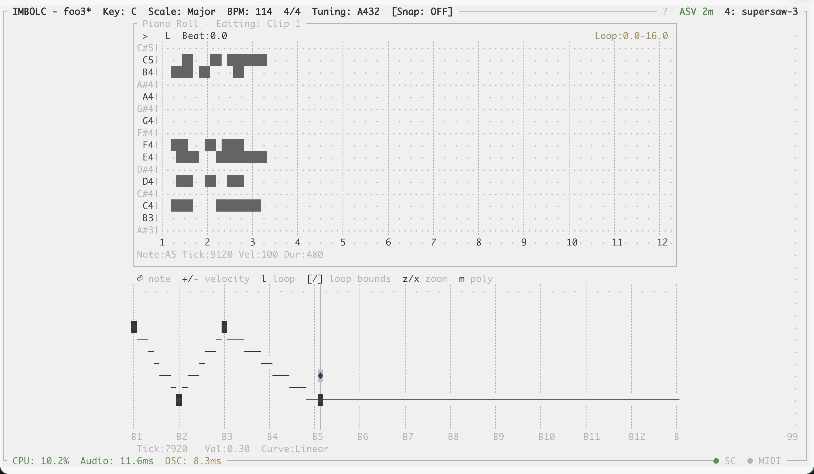
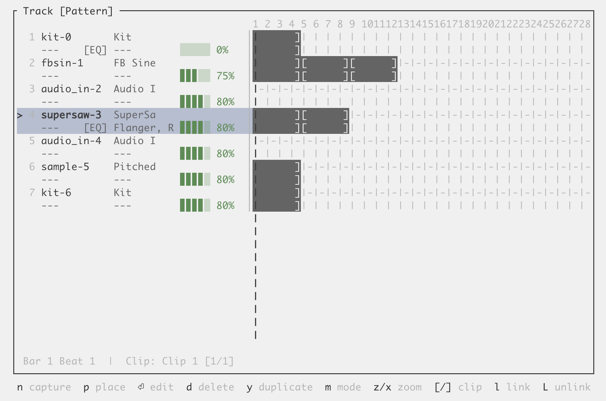
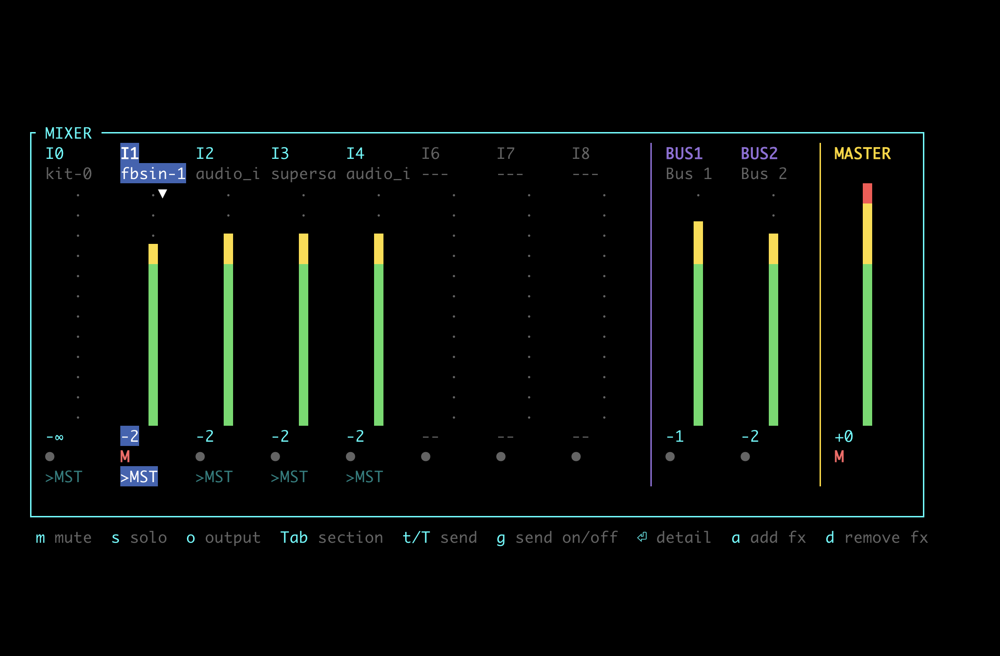
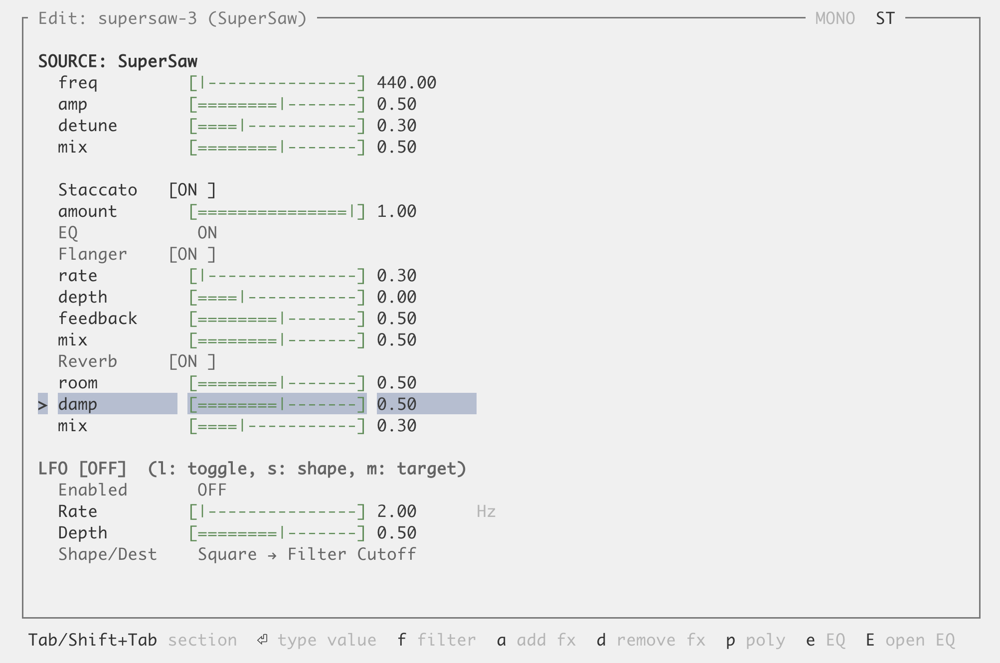
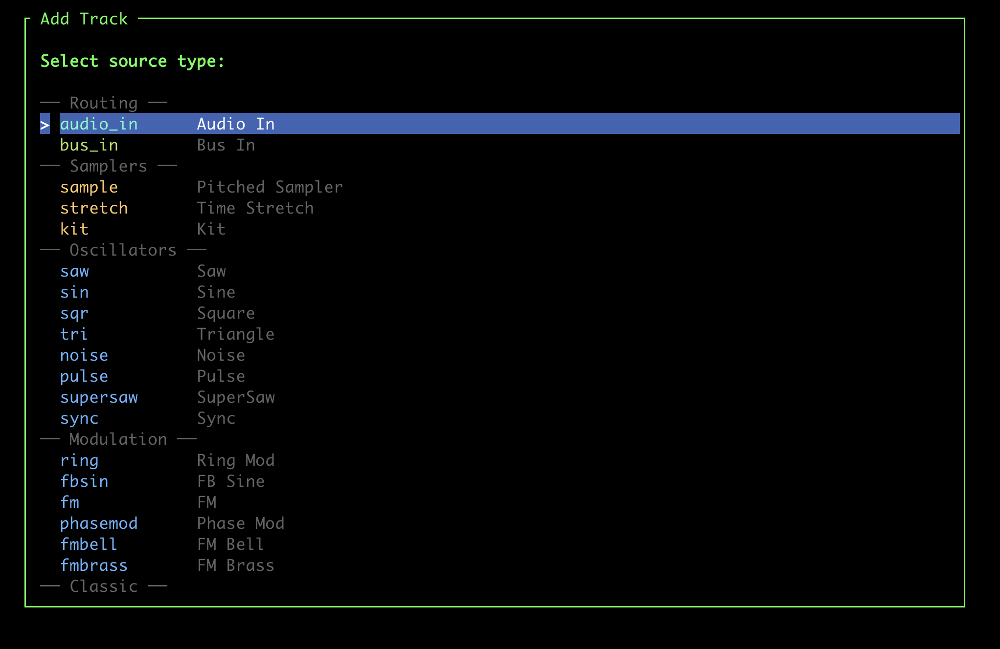
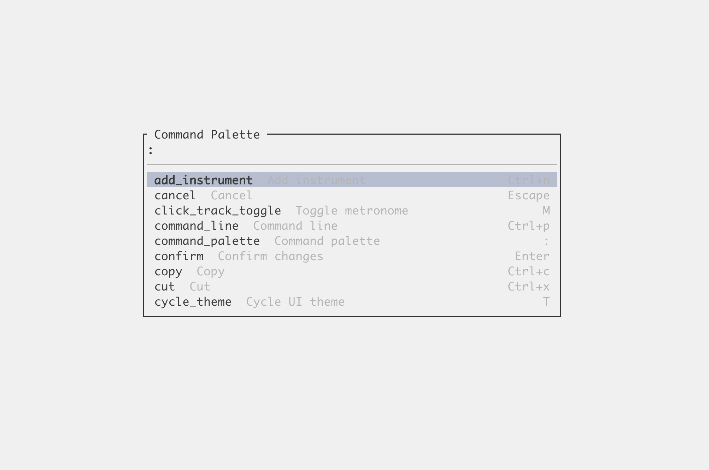
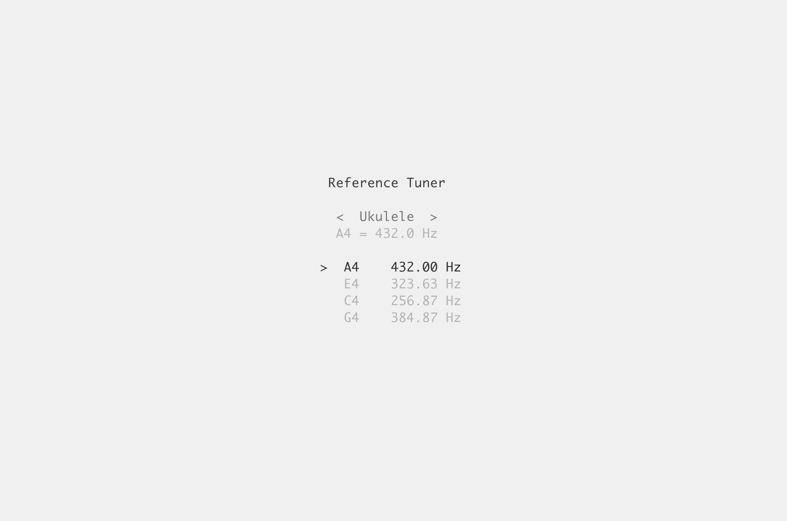

# [Imbolc Studio](https://imbolc.studio)

**A complete audio workstation in your terminal.**

> **Alpha software.** Imbolc is under active development. Expect rough edges. [Bug reports](https://github.com/mohsenil85/imbolc/issues) are very welcome.

Write beats, layer synthesizers, shape sounds with effects, mix tracks, record finished songs, annoy your neighbors, all from the comfort of your terminal.

## Highlights

### Sound Design

- **58 built-in instruments** — oscillators, FM synthesis, physical models, drums, classic synths, samplers, and more
- **39 built-in effects** — delays, reverbs, compressors, modulation, distortion, granular, spectral, and more
- **Semi-modular signal chain** — per-track source → LFO → effects → EQ → mixer with bus routing
- **Powered by SuperCollider** — professional-grade DSP with custom synthdefs

### Sequencing

- **Piano roll and drum sequencer** — per-note velocity and probability, variable grid resolution, groove and humanize
- **Automation** — automate any parameter with drawable lanes
- **Arpeggiator** — arpeggiate chords with configurable patterns

### Studio

- **Mixer with up to 128 buses** — per-track levels, pan, mute/solo, sends, and master control
- **Real-time LAN collaboration** — multiple players on a shared session over your local network
- **Record and export** — capture your session and export to WAV
- **SQLite project files** — projects are plain SQLite databases you can query, edit, and share with standard tools (patch export WIP)

### Does your DAW have

- **Stradella bass keyboard** — full accordion layout with automatic chord voicing across a circle-of-fifths grid
- **Just intonation** — 5 tuning systems (12-TET, scale JI, chord JI, adaptive JI, global JI) with 3 JI flavors (5-limit, 7-limit, Pythagorean)
- **Per-pad groove** — independent swing, timing offset, humanization, and time signature per pad
- **Generative composition** — Euclidean rhythms, Markov chains, and L-systems with macro controls for density, chaos, energy, and motion
- **Harmonic Snap** — notes automatically quantize to your key and scale

### Accessible REPL

TUIs can be an accessibility nightmare. Imbolc ships a full text-mode REPL with **236 commands** across 16 domains — every action available in the UI is available as a typed command.

- **Screen-reader friendly** — plain stdin/stdout, no visual UI required
- **Tab completion** — context-aware completion with inline hints
- **Readline Editing** - C-a, C-e, etc
- **Built-in help** — `help`, `help <group>`, `help <group> <command>`
- **Scriptable** — pipe a text file in for automated or headless music production
- **Works anywhere** — over SSH, in containers, on headless servers

## Support the Project

Imbolc is built by one person and given away for free. Sponsorship keeps development going — new instruments, new effects, and new features — while keeping Imbolc open source and $0 for everyone.

- [GitHub Sponsors](https://github.com/sponsors/mohsenil85)
- [Ko-fi](https://ko-fi.com/mohsenil85)

## Quick Start

1. Install [Rust](https://rustup.rs/) and [SuperCollider](https://supercollider.github.io/) (`scsynth` must be on your PATH).
2. Compile SynthDefs: `imbolc-core/bin/compile-synthdefs`
3. Run: `cargo run -p imbolc-ui --release`

**Terminal:** Works in any modern terminal. For the best experience (enhanced piano keyboard), use [Kitty](https://sw.kovidgoyal.net/kitty/) or [Ghostty](https://ghostty.org/).

## Keybindings

- F1 - Create instruments and groups
- F2 - Edit patterns
- F3 - Track View
- F4 - Mixer
- F12 - Server settings
- ? - Show keybindings
- : - Invoke
- ; - Repl
- ^n - New Instrument
- ^N - Add new instrument to current layer group
- ^m - Midi settings
- 1-0 - Select Instrument
- / - Piano mode
- ^q - Quit

## Community

- [GitHub Discussions](https://github.com/mohsenil85/imbolc/discussions) — feature requests and ideas
- Discord — chat, help, share music *(coming soon)*

## Documentation

- [Documentation](docs/README.md)
- [Installation Guide](docs/how-to/installation.md)
- [First Session Tutorial](docs/tutorials/first-session.md)

## License

This project is licensed under the GNU GPL v3.0. See [LICENSE](LICENSE) for details.
